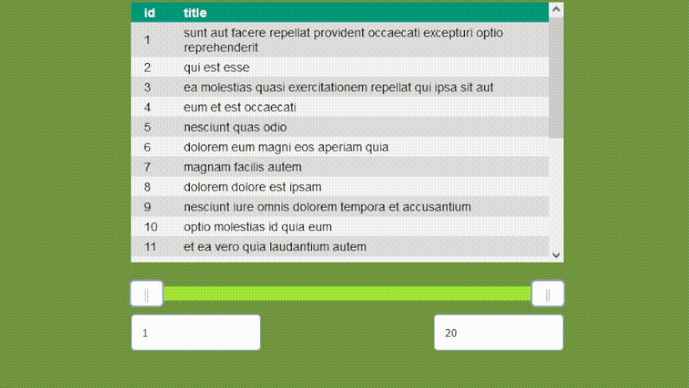

# Vue dual range slider

<div class="center">
    
</div>

Vue Dual Range Slider is a component written in Vue that allows you to easily select ranges of values. Ideal for applications where the user needs to specify a range, such as in filters, forms or interactive charts.

### Installation
```
npm install vue-dual-range-slider
```

### Props

|Prop|Type|Default|Description|
|---|---|---|---|
|minValue|Number|0|Minimal value on slider|
|maxValue|Number|100|Maximal value on slider|
|precision|Number|1|Sets maximal number of digits after decimal separator|
|dynamicEmit|Boolean|true|Enables emiting values during slider drag|
|startingMinValue|Number|null|Initial position of "minimal value slider" in default it is the same as minValue|
|startingMaxValue|Number|null|Initial position of "max value slider" in default it is the same as maxValue|
|timemode|Boolean|false|Changes displayed values into colon spearated time values|
|timeBaseUnit|TimeUnit|second|Defines input and output time unit|
|timeSmallestShownUnit|TimeUnit|second|Defines smallest unit that is shown|
|mainColor|String|#a3e635|Color of bar that is always beetwen two sliders|
|secondaryColor|String|#94a3b8|Color of background bar|
|inputRadius|String|5px|Rounding of input fields|
|inputBackgroundColor|String|white|Background color of input field|
|inputTextColor|String|black|Input text color|

#### TimeUnit

Each way of declaring TimeUnit is recognised. Names and shortcut names are not case sensitive.

|Name|Shortcut name|Numeric value|
|---|---|---|
|millisecond|ms|1|
|second|s|2|
|minute|m|3|
|hour|h|4|
|day|d|5|

### Events

|Name|Datatype|Description|
|---|---|---|
|changed|Number[]|Returns an array of two numbers: the first corresponds to the left slider, and the second to the right slider.|

### Exposed methods

|Method|Arguments|Description|
|---|---|---|
|setMin|value: number|Sets value of left slider
|setMax|value: number|Sets value of right slider
|resetValues||Resets values to default

### Example usage

```
<template>
    min: {{ min }} max: {{ max }}
    <DualRangeSlider @changed="(value) => handleChange(value)" />
</template>

<script setup lang="ts">
import DualRangeSlider from './components/DualRangeSlider.vue';
import { ref } from 'vue'

const min = ref(0)
const max = ref(100)

const handleChange = (newValues: number[]) => {
    min.value = newValues[0]
    max.value = newValues[1]
}
</script>

```